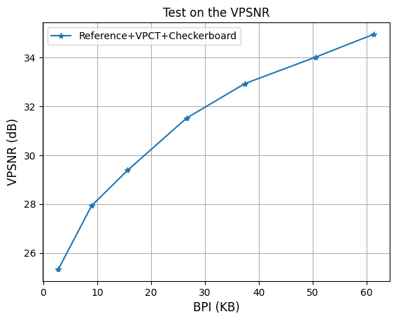

# The code for "Viewport-based Neural 360$\degree$ Image Compression"

## Experiment Environment
The proposed code was only tested on the ubuntu system. Please use the following script on the ubuntu system. Thank you!


## Installation

The proposed code is based on the [CompressAI](https://github.com/InterDigitalInc/CompressAI). The CompressAI supports python3.6+ and PyTorch 1.7+. Please make sure your test environment reach the requirement or use the following code to build a virtual python environment for this project.

Build and activate virtual python environment.

```
conda create --name anonymous-code python=3.8
conda activate anonymous-code
```

Install the required packages
```
pip install compressai
pip install einops
pip install thop
pip install opencv-python
pip install gdown
pip install jupyter
```

<!-- 
```
conda env create -f environment.yml
conda activate anonymous-code
pip install --upgrade gdown
``` -->

## Dataset and Pre-trained Model
Please download the [testing dataset](https://drive.google.com/uc?id=16SDuZSEoKt4WW76P6yH_Br5lHhXDJ1z1) and the [pre-trained model](https://drive.google.com/uc?id=1GUG4v1z-jOtZ3lXlJdmuojrJhfWMjzNh) before evaluating the proposed model.

## Framework Introducing
We propose a viewport-based pipeline to replace the traditional compression pipeline for 360-degree image compression. By replacing the conventional ERP projection with the viewport extraction, the proposed pipeline can mitigate the distortion and oversampling caused by the ERP projection and achieve better compression performance. The figure below illustrates the proposed viewport-based compression pipeline.


## Neural Viewport Codec Overview
The figure below illustrates the structure overview of the proposed neural viewport codec. Our method is compatible with existing 2D neural image compression methods, where the proposed VPCT module plays a crucial role in transforming conventional 2D image codecs into a viewport-based codec. 


## Model Introducing
This code demonstrates the performance of the Reference Entropy Model with VPCT. The model weights and test dataset are stored in an anonymous Google Drive, and will be automatically downloaded when running the test code. The training code and the code about jointing VPCT with other entropy models will also be opened after our work being accepted. The figure below illustrates the detailed structure of the compression model.


To accelerate the proposed VPCT module. We are using the checkerboard structure to optimize the VPCT module. The figure below illustrates the VPCT with Checkerboard structure.


Note: Since some components in the Reference Compression model are incompatible with the checkerboard structure, we have modified them in our model. For specific details, please refer the code.

## Code running
If you have a gpu on your device, please use 'test-cuda.ipynb' to test the proposed model.

If you can only use the cpu, please use 'test-cpu.ipynb' to test the proposed model.


## Experiment Results

