# The code for "Viewport-based Neural 360° Image Compression"

This repository contains the code for our paper "Viewport-based Neural 360° Image Compression". 

## Pipeline Comparison

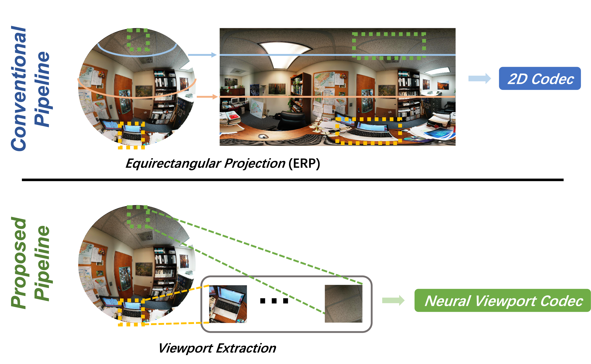

## Neural Viewport Codec & VPCT Module

| Neural Viewport Codec | VPCT Module |
| --- | --- |
| 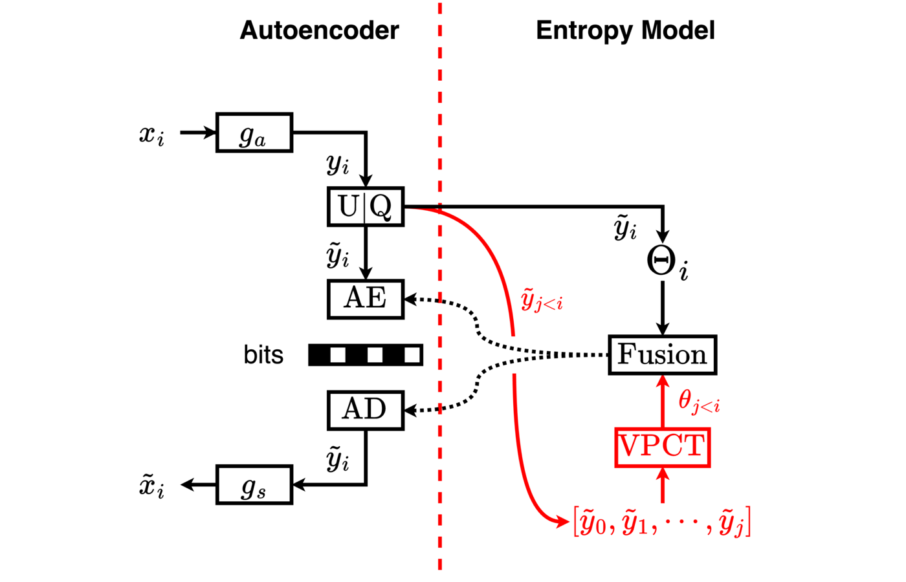 | 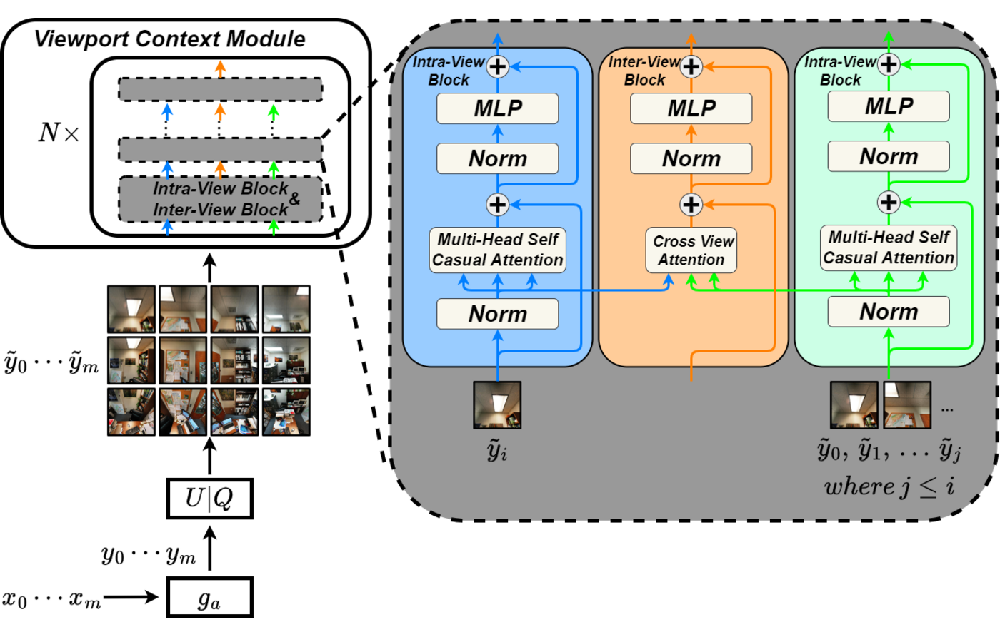 |

## Performance Comparison

### V-PSNR

| LIC360 (1K) | Flickr360 (2K) | CVIQ (4K) | SaliencyVR (8K) |
| --- | --- | --- | --- |
| 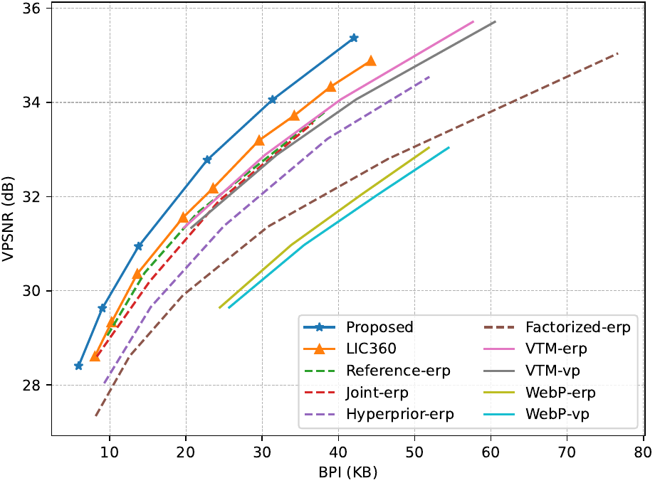 | 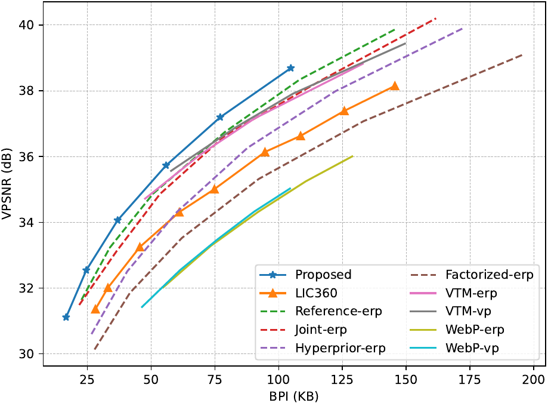 | 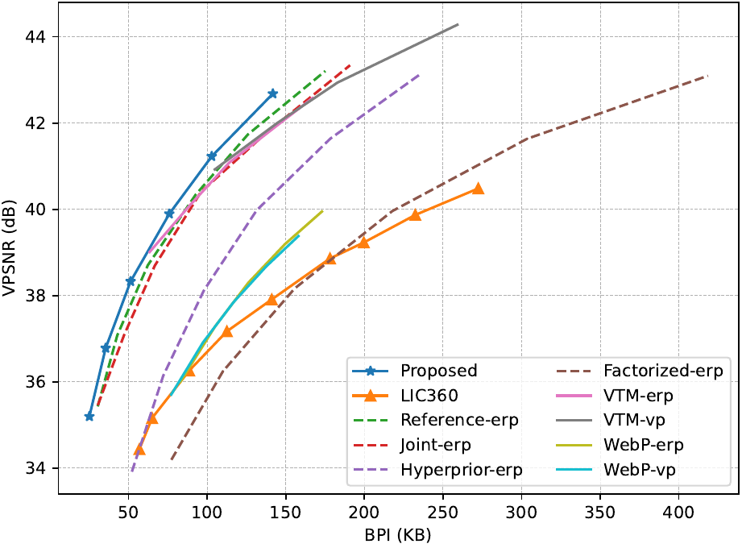 | 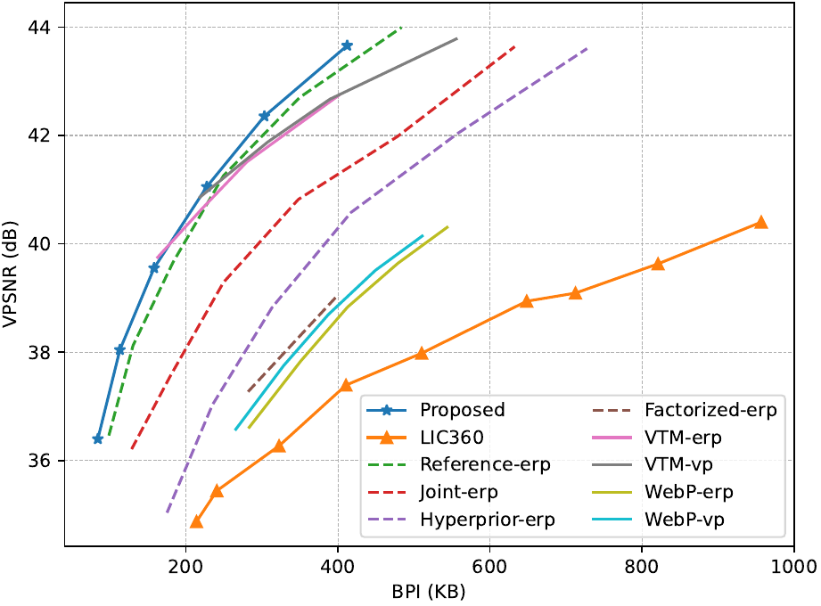 |

### V-SSIM

| LIC360 (1K) | Flickr360 (2K) | CVIQ (4K) | SaliencyVR (8K) |
| --- | --- | --- | --- |
| 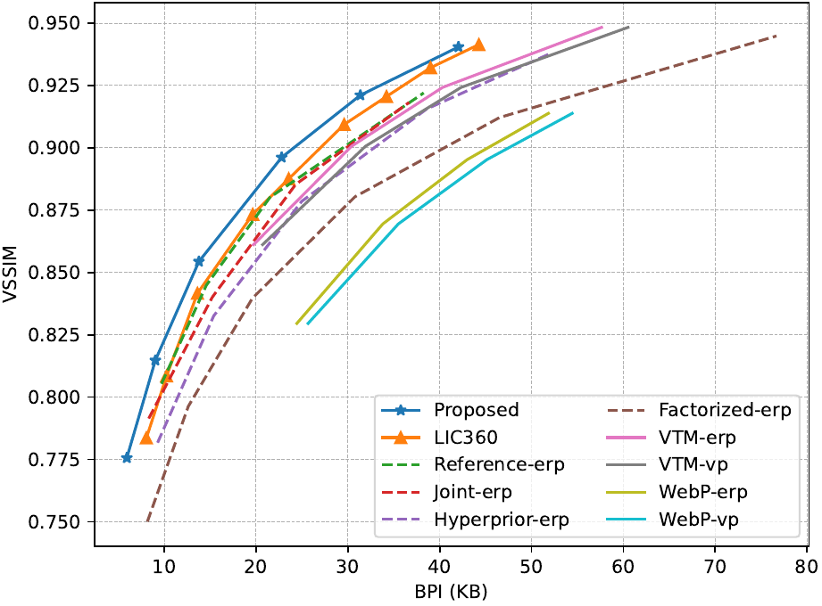 | 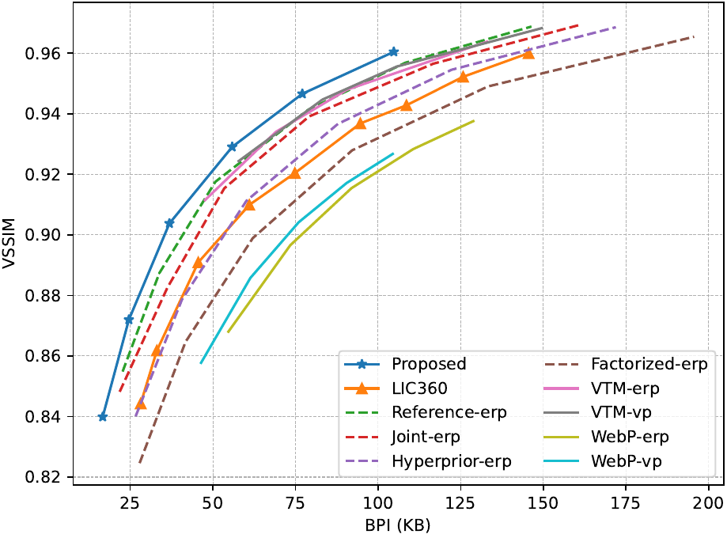 | 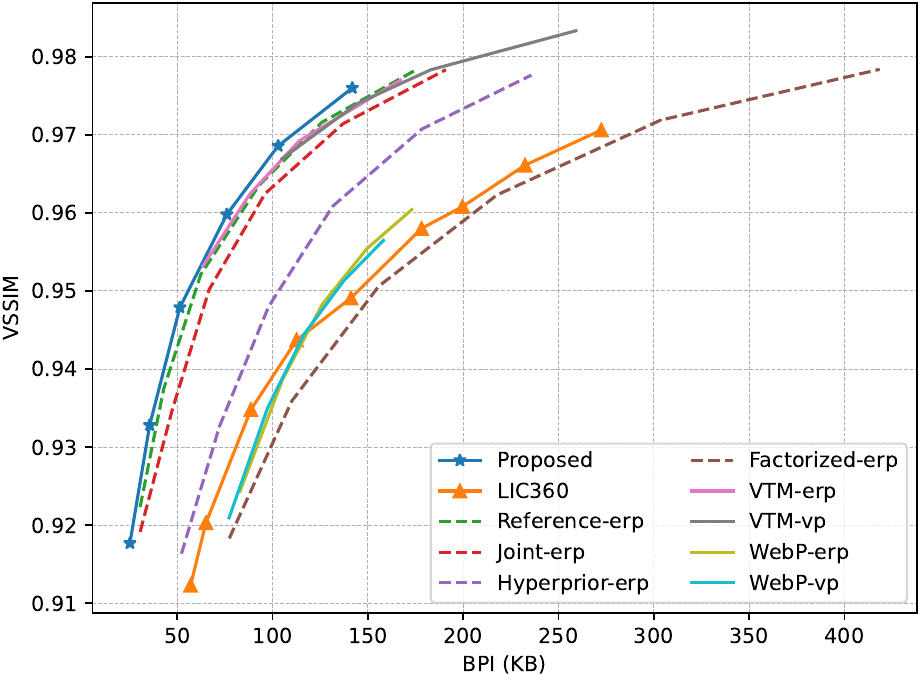 | 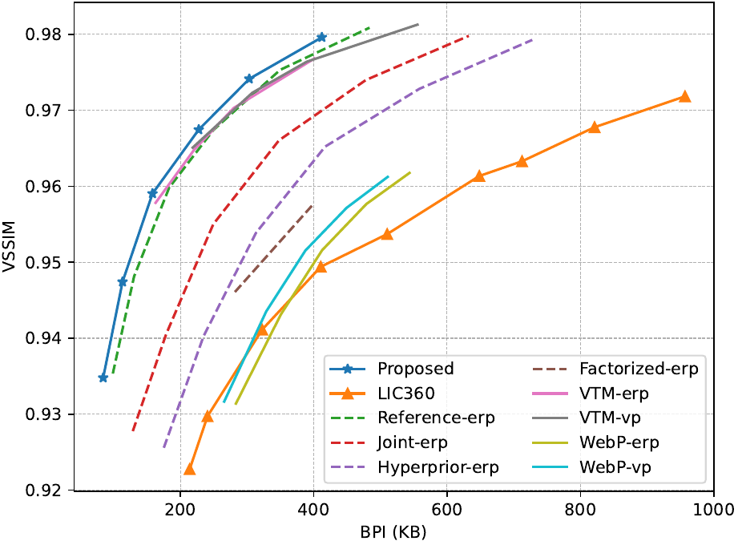 |

### V-LPIPS

| LIC360 (1K) | Flickr360 (2K) | CVIQ (4K) | SaliencyVR (8K) |
| --- | --- | --- | --- |
| 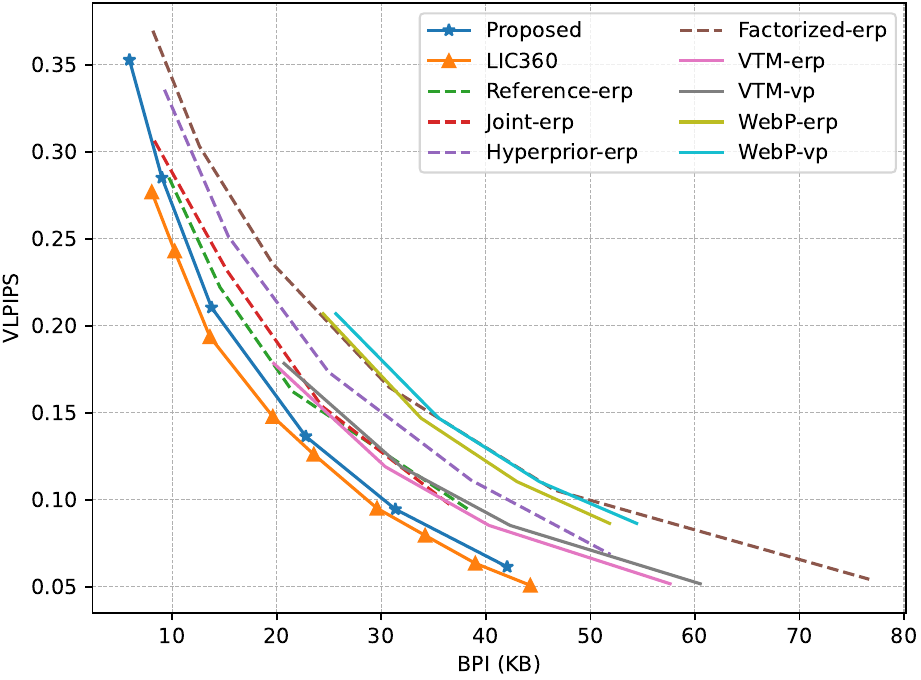 | 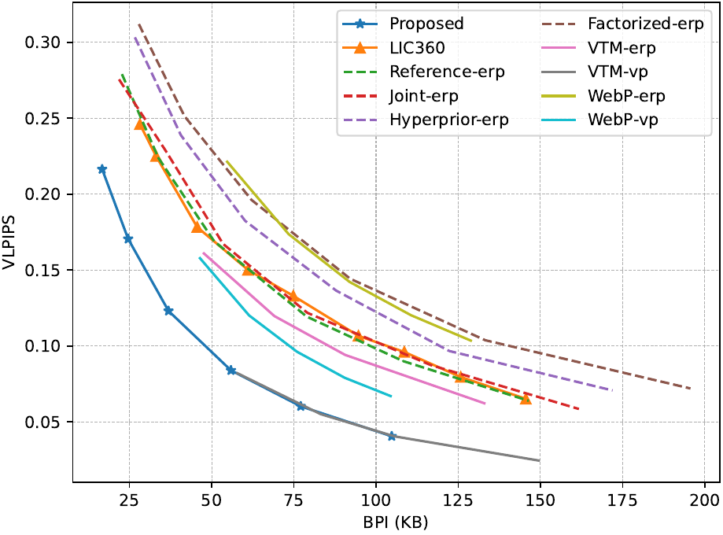 | 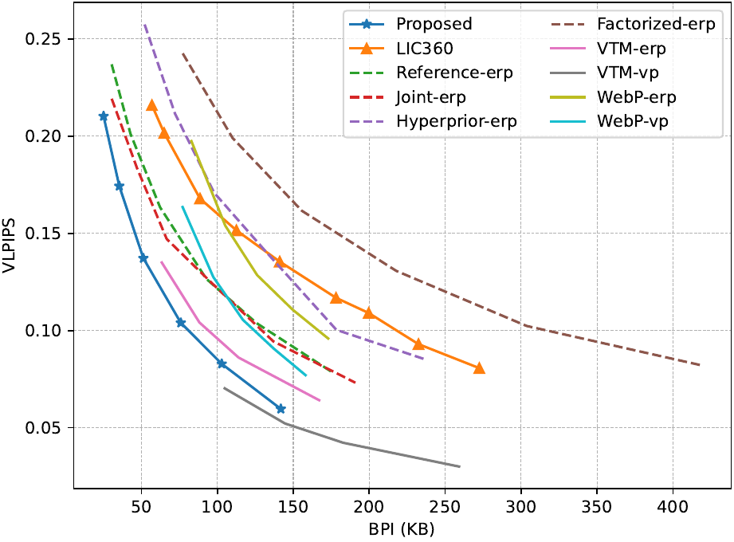 | 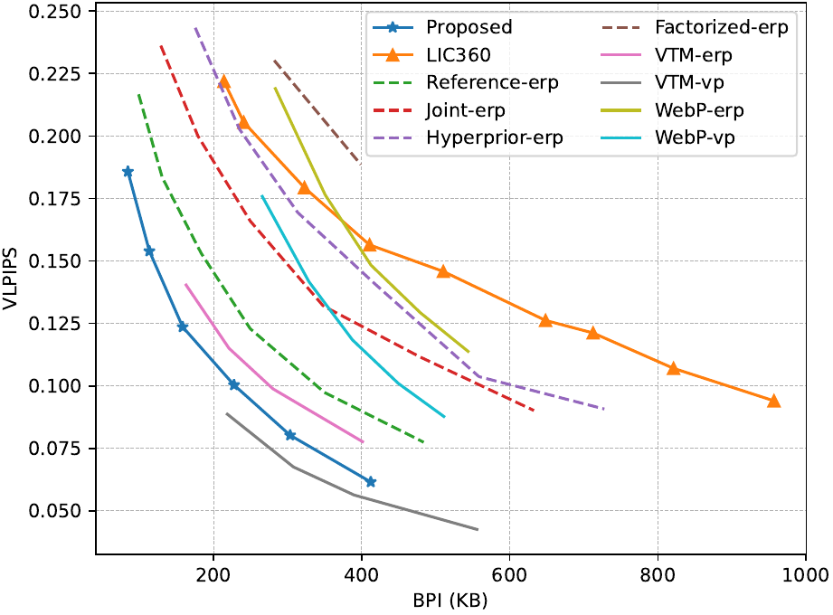 |

## Pretrained Models

**Google Drive**: https://drive.google.com/file/d/1W4mIwmmUk7IwUY7e1Afm91QHJHR_y_OA/view?usp=sharing

## Dataset

- LIC360: https://github.com/limuhit/360-Image-Compression/tree/main
- Flickr360: https://github.com/360SR/360SR-Challenge
- CVIQ: https://github.com/sunwei925/CVIQDatabase
- SaliencyVR: https://github.com/vsitzmann/vr-saliency?tab=readme-ov-file

## Training & Testing

We train the proposed model on the training set of the LIC360 dataset. We train each model for 200 epochs with a batch size of 8 on 1 NVIDIA A100 GPU. We then test the proposed model on the testing set of the LIC360 dataset and the testing sets of the Flickr360, CVIQ, and SaliencyVR datasets.

Example command is provided in the [scripts]() folder.
